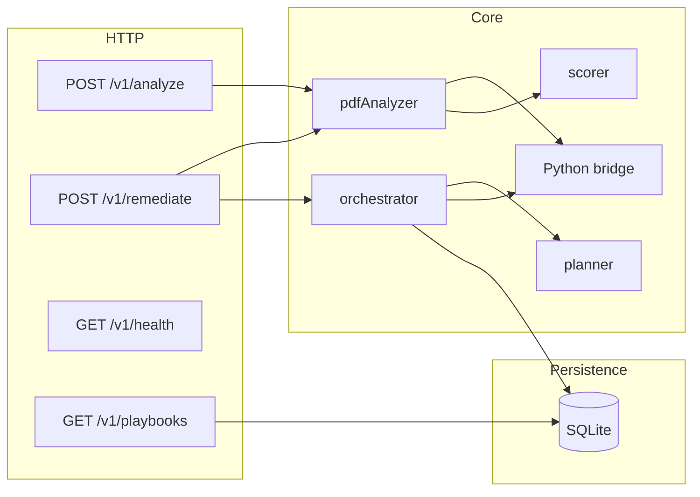

# PDFAF v2 — Architecture

Single **Node.js** HTTP service (Express) on port **6200** by default. No separate microservices; optional **LLM** calls use HTTPS to a user-configured OpenAI-compatible endpoint.

## Analysis pipeline (`analyzePdf`)

1. **Concurrency** — Semaphore caps parallel analyses (`MAX_CONCURRENT_ANALYSES`); excess requests fail fast with HTTP 429.
2. **Cache** — Optional in-memory cache keyed by file SHA-256 (`ANALYSIS_CACHE_TTL_MS`).
3. **Parallel extraction** — `pdfjs` for text/metadata; Python / `qpdf` for structure-heavy fields (merged into `DocumentSnapshot`).
4. **Scoring** — Pure `score(snapshot, meta)` → `AnalysisResult`.
5. **Persistence** — Best-effort insert into `queue_items` for telemetry (duration, full JSON blob).

## Remediation pipeline (`remediatePdf`)

1. **Playbook fast path** — Failure signature from initial analysis + snapshot; if an **active** playbook exists, replay stored tool stages via the same `runSingleTool` paths as the main loop.
2. **Planner** — Failing categories → staged tools (`planForRemediation`), filtered by implemented tools and optional **tool reliability** data from SQLite.
3. **Stages** — Within each stage, tools run sequentially; PDF is written to a temp path and **re-analyzed** for authoritative scoring. If the score **drops** vs stage start, the stage is **reverted** (buffer + analysis restored).
4. **Learning** — After a successful full run with sufficient score delta, **sanitized** applied tools are persisted into `playbooks`; each tool execution is recorded in `tool_outcomes`.
5. **Semantic passes** (optional) — Separate modules may call the configured LLM for figures/headings after deterministic remediation.

## Python bridge

[`src/python/bridge.ts`](../src/python/bridge.ts) spawns `python3` with [`python/pdf_analysis_helper.py`](../python/pdf_analysis_helper.py) and structured JSON over stdin/stdout or temp files (mutations path). **pikepdf** is required for reliable structure mutations. The script path resolves from `process.cwd()/python/...` first so `node dist/server.js` and Docker layouts work.

## SQLite schema

Defined in [`src/db/schema.ts`](../src/db/schema.ts):

- `queue_items` — analyzed PDF metadata + JSON result.
- `playbooks` — learned remediation sequences keyed by `failure_signature`.
- `tool_outcomes` — per-tool, per-`pdfClass` outcomes for reliability filtering.

`getDb()` in [`src/db/client.ts`](../src/db/client.ts) runs `initSchema` on first open.

## Configuration

All tunable numbers and feature flags for core behavior belong in [`src/config.ts`](../src/config.ts) — avoid scattering magic constants in routes or services.
