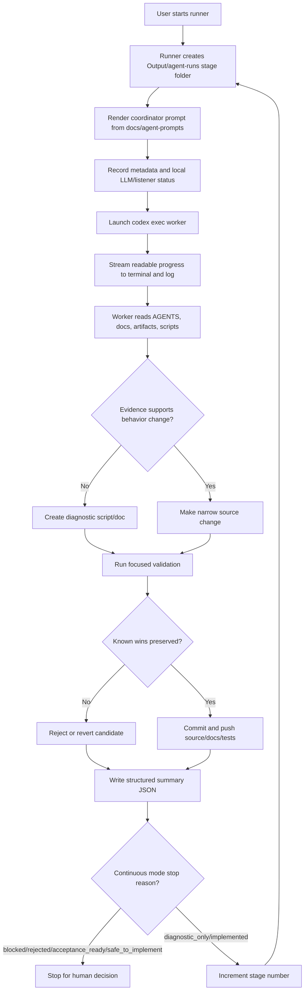
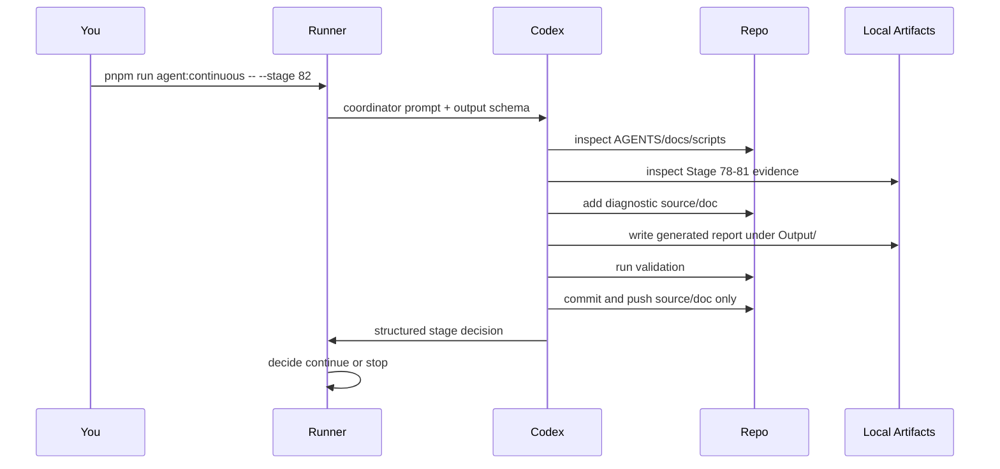
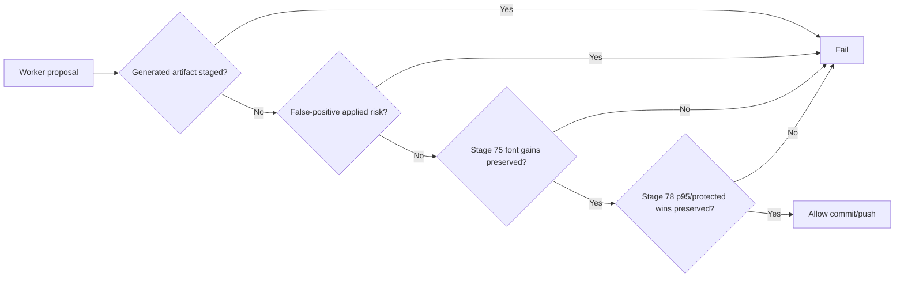

# Codex Stage Automation Flow



## Terminal Views

```text
tmux attach -t pdfaf-stage82
```

shows the live interactive session.

```text
tail -f Output/agent-runs/live/current.log
```

shows the log stream without attaching to tmux.

## Current Pattern



## Safety Gates


