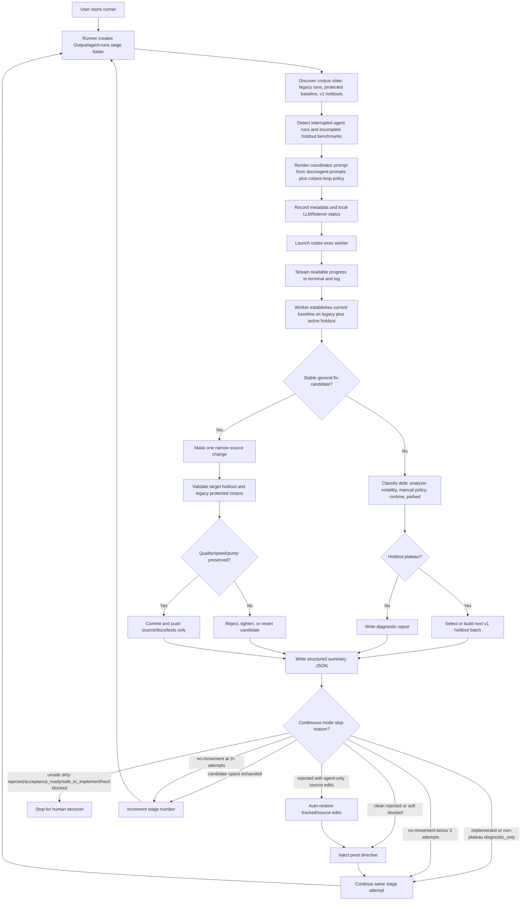
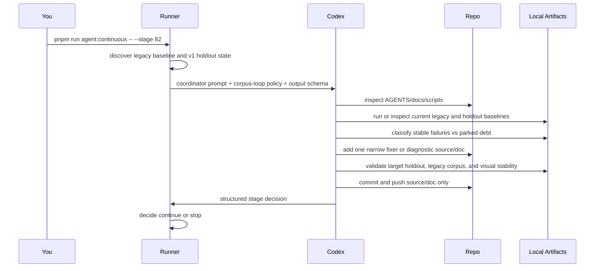
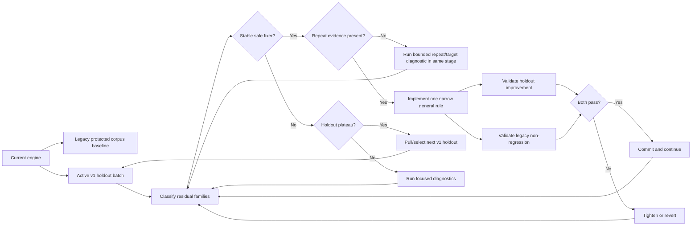
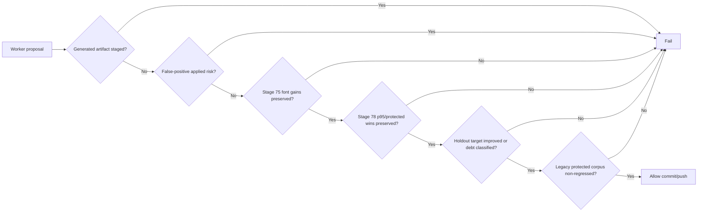

# Codex Stage Automation Flow



## Terminal Views

```text
tmux attach -t pdfaf-stage82
```

shows the live interactive session.

```text
tail -f Output/agent-runs/live/current.log
```

shows the log stream without attaching to tmux.

## Current Pattern



## Corpus Evolution Loop



## Stage Checklist

1. **Preflight:** git state, disk, local LLM/listeners, protected baseline, active holdout, latest artifacts.
2. **Baseline:** current legacy 50 plus active v1 holdout metrics.
3. **Classify:** stable fix candidates vs analyzer volatility, manual/OCR policy debt, runtime tail, protected parity debt, controls.
4. **Select:** one stable general family, or declare plateau and select/build a new v1 holdout.
5. **Diagnose:** smallest target sample with controls, timelines, category deltas, raw evidence, and visual-risk signals.
6. **Repeat Before Stopping:** if stable candidates exist and repeat evidence is bounded, run that repeat/target diagnostic in the same stage.
7. **Plateau Gate:** before `diagnostic_only`, prove the plateau definition is satisfied.
8. **Decide:** implement only with a proven safe general rule; otherwise park and report.
9. **Implement:** one narrow criterion-driven change with tests, no filename/corpus-specific logic.
10. **Focused Validate:** static/unit tests, target rows, controls, visual diff when needed.
11. **Holdout Validate:** active v1 holdout or justified subset, with previous holdout wins preserved.
12. **Legacy Validate:** protected legacy validation and Stage 41 gate for behavior changes when feasible.
13. **Commit Or Reject:** source/docs/tests only, generated artifacts remain local.
14. **Summarize:** evidence, commands, artifacts, gates, plateau status, remaining debt, next stage.

## Interruption Recovery

Each evolve launch now reports:

- the active v1 holdout manifest, chosen from the newest local v1 holdout manifest;
- the active completed holdout benchmark run;
- interrupted agent run directories that have a prompt but no summary;
- incomplete holdout benchmark directories that lack `summary.json`.

If a stage is interrupted during a holdout pivot, the next launch should reuse the completed fresh manifest and rerun only incomplete benchmark output dirs to a new output path. It should not rebuild or discard a fresh holdout unless the manifest itself is missing or corrupt.

## Plateau Definition

A stage may declare plateau only through one of two paths:

- exhaustive candidate-space proof: all criteria below are true;
- repeated no-movement: at least three same-stage implementation/candidate attempts pivoted among available stable residual families with source changes or attempted behavior, but without a safe kept source change or measurable holdout/legacy movement. Pure evidence-gathering or diagnostic-only passes with no source changes do not count.

The exhaustive criteria are:

1. Active holdout and legacy protected baseline metrics are known or intentionally refreshed/inspected.
2. Every non-manual residual row is classified.
3. Stable candidates in the selected family either produced a safe implemented rule or have bounded evidence proving no safe general rule right now.
4. No bounded next diagnostic remains that could decide implementation or rejection inside the current stage.
5. Prior named wins are checked or explicitly scoped as unaffected: font gains, visible/OCR/degenerate heading gains, false-positive applied `0`, protected rows, runtime p95, page/text/tag/link stability, and visual stability.
6. The next action is a real pivot to another family, a fresh v1 holdout, analyzer/runtime project, or human acceptance decision.

If the needed evidence is locally bounded, the worker should keep going inside the same stage instead of returning `diagnostic_only`. One no-progress attempt is not a plateau unless it proves candidate-space exhaustion.

## Safety Gates


