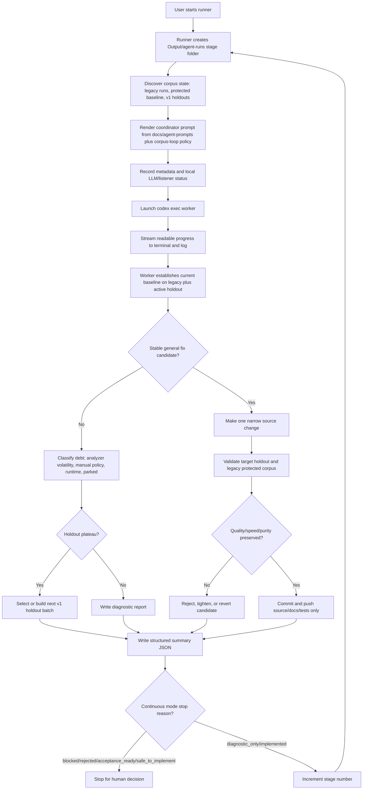
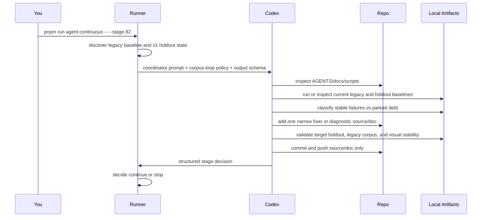
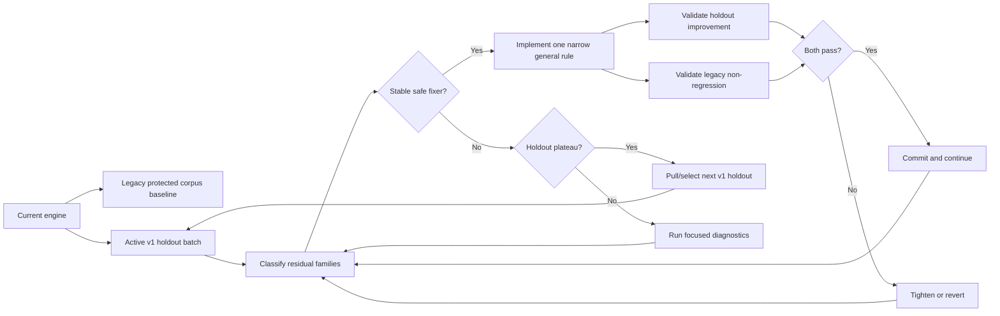
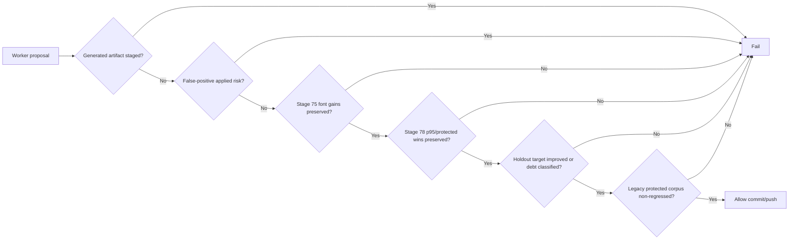

# Codex Stage Automation Flow



## Terminal Views

```text
tmux attach -t pdfaf-stage82
```

shows the live interactive session.

```text
tail -f Output/agent-runs/live/current.log
```

shows the log stream without attaching to tmux.

## Current Pattern



## Corpus Evolution Loop



## Stage Checklist

1. **Preflight:** git state, disk, local LLM/listeners, protected baseline, active holdout, latest artifacts.
2. **Baseline:** current legacy 50 plus active v1 holdout metrics.
3. **Classify:** stable fix candidates vs analyzer volatility, manual/OCR policy debt, runtime tail, protected parity debt, controls.
4. **Select:** one stable general family, or declare plateau and select/build a new v1 holdout.
5. **Diagnose:** smallest target sample with controls, timelines, category deltas, raw evidence, and visual-risk signals.
6. **Decide:** implement only with a proven safe general rule; otherwise park and report.
7. **Implement:** one narrow criterion-driven change with tests, no filename/corpus-specific logic.
8. **Focused Validate:** static/unit tests, target rows, controls, visual diff when needed.
9. **Holdout Validate:** active v1 holdout or justified subset, with previous holdout wins preserved.
10. **Legacy Validate:** protected legacy validation and Stage 41 gate for behavior changes when feasible.
11. **Commit Or Reject:** source/docs/tests only, generated artifacts remain local.
12. **Summarize:** evidence, commands, artifacts, gates, remaining debt, next stage.

## Safety Gates


