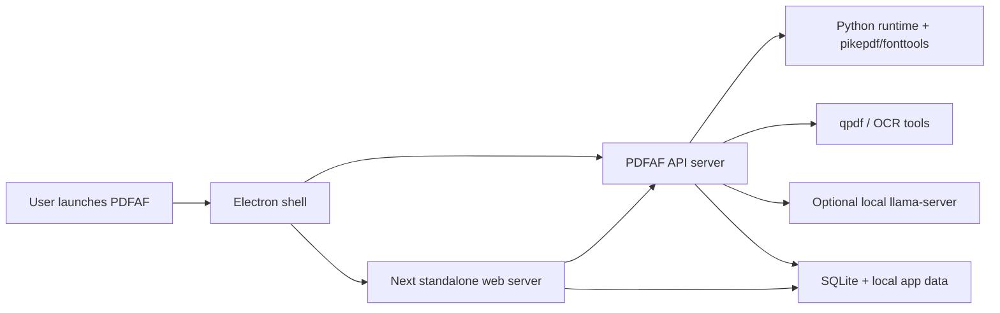

# Windows App Plan

## Purpose

This branch introduces a Windows desktop distribution path for PDFAF v2 without rewriting the existing product stack. The intent is to keep the current architecture:

- Node/Express API in `src/`
- Next.js web app in `apps/pdf-af-web/`
- optional local AI model served through `llama-server`

The Windows app should package those parts behind a desktop shell, produce a Windows installer, and make startup/runtime behavior predictable for non-technical users.

## Recommended Direction

The quickest practical route is:

1. Add an Electron desktop shell in a new app such as `apps/desktop`.
2. Build and bundle the existing API and web app as local child processes.
3. Use `electron-builder` to generate a Windows installer, preferably NSIS first.
4. Keep the AI model as a post-install or first-run download instead of bundling it into the installer.

This approach avoids a full frontend rewrite and avoids forcing Docker Desktop to be part of the end-user runtime.

## Why This Route

Electron is the shortest path because the existing application already depends heavily on Node.js behavior:

- Next server routes are already part of the app shape.
- The API uses child processes, local binaries, SQLite, and filesystem access.
- The web app already expects a local API endpoint.
- Packaging with Electron is simpler than re-platforming to a thinner shell while keeping the same runtime assumptions.

Tauri could be reconsidered later if installer size becomes a top concern, but it is not the fastest path to a first Windows release.

## Target Windows Architecture

The target packaged application should look like this:

## Desktop Lifecycle And Tray Behavior

The Windows app should behave like a resident desktop utility, not like a browser tab wrapper.

Required behavior:

- the app shows a notification area icon while running
- closing the main window does not terminate the app
- closing the main window hides the window and keeps the app alive in the notification area
- double-clicking the notification area icon opens or restores the main app window
- right-clicking the notification area icon opens a context menu with:
  - open app
  - restart services
  - exit

Recommended supporting behavior:

- first close should show a one-time hint that the app is still running in the notification area
- selecting `Exit` should perform a real shutdown of Electron, the API process, the web server process, and any optional local model process started by the app
- selecting `Restart services` should restart the managed API/web/model child processes without requiring a full reinstall
- if the user reopens the app from the Start menu while it is already running, the existing instance should be focused instead of spawning a second resident copy

This tray-first lifecycle needs to be part of the initial desktop shell design because it affects process ownership, shutdown semantics, single-instance locking, and support expectations.

## Desktop Storage Policy

The Windows app should not inherit the web app's temporary server-style retention rules.

Desktop storage should be persistent by default:

- store source PDFs in local app data
- store remediated PDFs in local app data
- store SQLite databases in local app data
- store logs in local app data
- store model files in local app data

Recommended Windows root:

- `%LOCALAPPDATA%\PDFAF\data\`

Recommended subdirectories:

- `source\`
- `remediated\`
- `db\`
- `logs\`
- `llm\`
- `temp\`

The desktop build should not auto-delete files after 24 hours and should not apply the current web quota deletion behavior by default.

Instead of automatic retention cleanup, the desktop app should provide user-controlled cleanup actions such as:

- open data folder
- clear temporary files
- delete saved source PDFs
- delete saved remediated PDFs
- delete model files

## Installer Strategy

### Initial installer contents

The installer should include:

- Electron desktop shell
- compiled API output
- compiled Next standalone output
- Node runtime needed by the packaged app
- Windows-safe configuration defaults
- required non-model dependencies that are necessary for core operation

The installer should not include large model weights in the first version unless offline-only operation is a hard requirement.

### Model strategy

Recommended model flow:

1. Install the desktop app.
2. On first launch, prompt the user to:
   - use a remote AI endpoint, or
   - download the local model
3. If local model is selected, download:
   - `llama-server`
   - GGUF model
   - `mmproj` file when required
4. Store model assets in a writable per-user directory such as `%LOCALAPPDATA%\PDFAF\data\llm\`.
5. Enable local-AI features only after a successful health check.

Docker can remain a developer/distribution option, but it should not be the required end-user mechanism for model installation on Windows.

## Known Gaps In The Current Repo

The current codebase is close to being packageable, but it still contains assumptions that are better suited to Docker or Unix-like environments.

### 1. Python executable is hardcoded

Current code uses `python3` directly in the API bridge and health checks. On Windows, that often needs to be:

- `python`
- a packaged interpreter path
- or a configurable env var such as `PDFAF_PYTHON_BIN`

### 2. Storage defaults are container-oriented

The web app currently defaults file storage to `/data`, which is not a desktop-safe default. The Windows app should use a writable app data directory and treat saved PDFs as persistent local files rather than expiring server artifacts.

### 3. API startup is not app-managed

The web tier assumes a local API on `http://localhost:6200`. A desktop app must own:

- process launch
- health wait
- shutdown
- error reporting
- port selection or collision handling

### 4. External binary handling is not yet desktop-first

The API depends on tools like:

- `qpdf`
- Python with `pikepdf` and `fonttools`
- optional `tesseract`
- optional `ocrmypdf`
- optional `llama-server`

The Windows app needs a clear rule for which of these are bundled, which are optional, and where they are installed.

## Work Required

## Staged Delivery Plan

### Stage 0: Packaging spike

Goal:

- prove the current repo can be wrapped in Electron without a major rewrite

Scope:

- create `apps/desktop`
- launch a minimal BrowserWindow
- spawn the existing API and web app in development mode
- confirm Electron can open the web app locally

Exit criteria:

- one command starts Electron, API, and web app together in development
- window can open and close without orphaning dev child processes

### Stage 1: Production process orchestration

Goal:

- turn the desktop shell into the runtime owner for packaged builds

Scope:

- build API for production
- build Next app in standalone mode
- have Electron spawn both as managed child processes
- wait for health before loading the UI
- implement single-instance locking

Exit criteria:

- packaged development build opens reliably
- app can recover from slow API/web startup
- second launch focuses the existing app instance

### Stage 2: Desktop persistence and path safety

Goal:

- make the runtime truly Windows-safe and desktop-oriented

Scope:

- add desktop app data path injection
- route DB, PDFs, logs, temp files, and model files into app data
- add desktop storage policy separation from web retention/quota behavior
- add configurable Python binary support

Exit criteria:

- PDFs and outputs persist across restarts
- no 24-hour expiry behavior in desktop mode
- no writes depend on Docker-style `/data` paths

### Stage 3: Tray lifecycle and background behavior

Goal:

- make the app behave like a resident Windows utility

Scope:

- add notification area icon
- hide to tray on window close
- add tray context menu with `Open App`, `Restart Services`, and `Exit`
- add double-click restore behavior
- add one-time user education on first close

Exit criteria:

- closing the window keeps the app alive in the notification area
- reopening from the tray restores the same instance
- `Exit` shuts down all managed processes cleanly
- `Restart Services` works without leaving duplicate processes behind

### Stage 4: Dependency bundling

Goal:

- make core desktop functionality work on a clean Windows machine

Scope:

- decide what is bundled versus optional
- package core binaries required for analyze/remediate flows
- add startup diagnostics for missing optional dependencies
- define whether OCR is first-release or deferred

Exit criteria:

- clean machine can run core app features after install
- missing optional tools produce actionable status and errors

### Stage 5: Local model installation

Goal:

- support optional local AI without bloating the installer

Scope:

- first-run or settings-based model install flow
- remote AI mode available immediately
- local model download with progress and retry
- model health validation after install

Exit criteria:

- remote AI mode works without local downloads
- local model can be installed from inside the app
- installed model survives app restarts and upgrades

### Stage 6: Installer production

Goal:

- generate a repeatable installer that is suitable for user distribution

Scope:

- add `electron-builder`
- produce NSIS installer
- configure app metadata, icons, shortcuts, uninstall behavior, and upgrade behavior
- test install, uninstall, and reinstall flows

Exit criteria:

- installer works on a clean Windows machine
- installed app launches from Start menu and notification area behavior works
- uninstall removes the app and leaves user data only if explicitly intended

### Stage 7: Full test and release hardening

Goal:

- move from "it runs" to "it is supportable"

Scope:

- add desktop smoke tests
- add installer validation checklist
- add child-process failure handling and restart behavior
- add structured desktop logs and support docs
- verify startup, shutdown, tray behavior, persistence, remediation, and model setup on clean machines

Exit criteria:

- release checklist passes on at least one clean Windows environment
- known-failure cases have actionable UI or logs
- installer is ready for external testing or public release

### Phase 1: Desktop shell scaffolding

- Create `apps/desktop` for Electron main/preload code.
- Add scripts to build API, web, and desktop together.
- Configure production startup for:
  - API child process
  - Next standalone child process
  - Electron BrowserWindow
- Add health-check wait logic before loading the app UI.
- Add single-instance app locking.

### Phase 2: Windows-safe runtime configuration

- Add `PDFAF_PYTHON_BIN` support and use it everywhere Python is invoked.
- Add a desktop-safe default storage root for:
  - API database
  - web app saved files
  - temp and model work directories where needed
- Add an explicit storage policy split between:
  - desktop persistent storage
  - web ephemeral storage
- Disable automatic retention expiry and quota deletion in desktop mode.
- Stop relying on fixed `localhost:6200` assumptions in production packaging.
- Define a single source of truth for runtime paths injected by Electron.

### Phase 3: Tray lifecycle and background behavior

- Add a notification area icon that stays present while the app is running.
- Change window close behavior to hide to tray instead of exiting.
- Add tray menu actions for:
  - open app
  - restart services
  - exit
- Add double-click tray restore behavior.
- Add one-time messaging so users understand that closing the window does not exit the app.
- Ensure `Exit` performs a real full shutdown of managed child processes.

### Phase 4: Dependency packaging

- Decide which dependencies are bundled in the installer:
  - Node runtime
  - Python runtime or Python prerequisite
  - `qpdf`
  - optional OCR tools
  - optional `llama-server`
- Add packaging logic for Windows binaries.
- Add first-run verification for missing dependencies and actionable user messages.

### Phase 5: Model installation flow

- Add first-run UI for model selection.
- Support a remote AI mode that works immediately without local download.
- Add a local model installer with:
  - progress
  - retry
  - disk-space messaging
  - cancel/resume if practical
- Persist model paths and health state in app config.

### Phase 6: Installer generation

- Add `electron-builder` config.
- Produce an NSIS installer.
- Configure app icons, product name, versioning, and output directories.
- Validate clean install, upgrade install, and uninstall behavior.

### Phase 7: Production hardening

- Add structured desktop logs for:
  - process startup failures
  - dependency detection failures
  - model download failures
  - child process exits
- Add desktop settings/actions for storage management instead of background expiry.
- Add desktop smoke tests.
- Confirm behavior on a clean Windows machine without developer tooling installed.

## Proposed Deliverables

The branch should eventually produce:

- a desktop shell app under `apps/desktop`
- Windows-specific runtime path handling
- persistent desktop storage in app data
- notification area resident behavior with tray controls
- a first-run setup experience
- optional local model installation flow
- a repeatable Windows installer build
- documentation for support and release use

## Suggested Implementation Order

For the fastest useful progress, implement in this order:

1. Electron shell and process orchestration
2. Windows-safe path and interpreter configuration
3. tray lifecycle and single-instance behavior
4. standalone build wiring for the web app and API
5. installer config with a minimal non-model package
6. first-run local model download flow
7. optional OCR and other heavier dependencies

## Definition of Done For First Windows Release

The first Windows release should be considered successful when a non-technical user can:

1. Run the installer.
2. Launch the desktop app from the Start menu.
3. Analyze and remediate PDFs without manually starting servers.
4. Close the main window and still find the app running in the notification area.
5. Reopen the UI by double-clicking the notification area icon.
6. Use the tray menu to open the app, restart services, or exit.
7. Use either remote AI immediately or install the local AI model from inside the app.
8. Reopen previously saved PDFs and remediated outputs from persistent local storage.
9. Exit the app cleanly without orphaned local processes.

## Notes

- The first release should prioritize reliability over installer compactness.
- Avoid making Docker Desktop a required end-user dependency.
- Keep model weights out of the installer unless offline-only use is required.
- Do not carry over the web app's 24-hour retention and quota deletion model into desktop mode.
- Keep generated PDF payloads and base64 blobs out of docs, logs, and commits.
