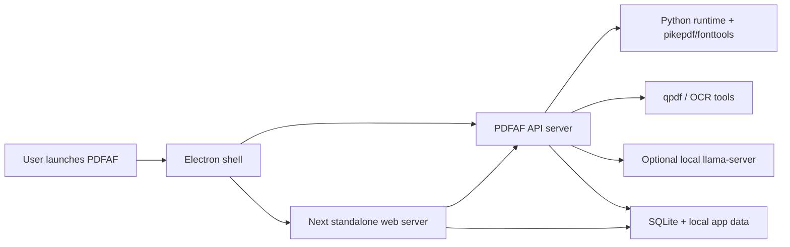

# Windows App Plan

## Purpose

This branch introduces a Windows desktop distribution path for PDFAF v2 without rewriting the existing product stack. The intent is to keep the current architecture:

- Node/Express API in `src/`
- Next.js web app in `apps/pdf-af-web/`
- optional local AI model served through `llama-server`

The Windows app should package those parts behind a desktop shell, produce a Windows installer, and make startup/runtime behavior predictable for non-technical users.

## Recommended Direction

The quickest practical route is:

1. Add an Electron desktop shell in a new app such as `apps/desktop`.
2. Build and bundle the existing API and web app as local child processes.
3. Use `electron-builder` to generate a Windows installer, preferably NSIS first.
4. Keep the AI model as a post-install or first-run download instead of bundling it into the installer.

This approach avoids a full frontend rewrite and avoids forcing Docker Desktop to be part of the end-user runtime.

## Why This Route

Electron is the shortest path because the existing application already depends heavily on Node.js behavior:

- Next server routes are already part of the app shape.
- The API uses child processes, local binaries, SQLite, and filesystem access.
- The web app already expects a local API endpoint.
- Packaging with Electron is simpler than re-platforming to a thinner shell while keeping the same runtime assumptions.

Tauri could be reconsidered later if installer size becomes a top concern, but it is not the fastest path to a first Windows release.

## Target Windows Architecture

The target packaged application should look like this:

## Installer Strategy

### Initial installer contents

The installer should include:

- Electron desktop shell
- compiled API output
- compiled Next standalone output
- Node runtime needed by the packaged app
- Windows-safe configuration defaults
- required non-model dependencies that are necessary for core operation

The installer should not include large model weights in the first version unless offline-only operation is a hard requirement.

### Model strategy

Recommended model flow:

1. Install the desktop app.
2. On first launch, prompt the user to:
   - use a remote AI endpoint, or
   - download the local model
3. If local model is selected, download:
   - `llama-server`
   - GGUF model
   - `mmproj` file when required
4. Store model assets in a writable per-user directory such as `%LOCALAPPDATA%\PDFAF\data\llm\`.
5. Enable local-AI features only after a successful health check.

Docker can remain a developer/distribution option, but it should not be the required end-user mechanism for model installation on Windows.

## Known Gaps In The Current Repo

The current codebase is close to being packageable, but it still contains assumptions that are better suited to Docker or Unix-like environments.

### 1. Python executable is hardcoded

Current code uses `python3` directly in the API bridge and health checks. On Windows, that often needs to be:

- `python`
- a packaged interpreter path
- or a configurable env var such as `PDFAF_PYTHON_BIN`

### 2. Storage defaults are container-oriented

The web app currently defaults file storage to `/data`, which is not a desktop-safe default. The Windows app should use a writable app data directory.

### 3. API startup is not app-managed

The web tier assumes a local API on `http://localhost:6200`. A desktop app must own:

- process launch
- health wait
- shutdown
- error reporting
- port selection or collision handling

### 4. External binary handling is not yet desktop-first

The API depends on tools like:

- `qpdf`
- Python with `pikepdf` and `fonttools`
- optional `tesseract`
- optional `ocrmypdf`
- optional `llama-server`

The Windows app needs a clear rule for which of these are bundled, which are optional, and where they are installed.

## Work Required

### Phase 1: Desktop shell scaffolding

- Create `apps/desktop` for Electron main/preload code.
- Add scripts to build API, web, and desktop together.
- Configure production startup for:
  - API child process
  - Next standalone child process
  - Electron BrowserWindow
- Add health-check wait logic before loading the app UI.

### Phase 2: Windows-safe runtime configuration

- Add `PDFAF_PYTHON_BIN` support and use it everywhere Python is invoked.
- Add a desktop-safe default storage root for:
  - API database
  - web app saved files
  - temp and model work directories where needed
- Stop relying on fixed `localhost:6200` assumptions in production packaging.
- Define a single source of truth for runtime paths injected by Electron.

### Phase 3: Dependency packaging

- Decide which dependencies are bundled in the installer:
  - Node runtime
  - Python runtime or Python prerequisite
  - `qpdf`
  - optional OCR tools
  - optional `llama-server`
- Add packaging logic for Windows binaries.
- Add first-run verification for missing dependencies and actionable user messages.

### Phase 4: Model installation flow

- Add first-run UI for model selection.
- Support a remote AI mode that works immediately without local download.
- Add a local model installer with:
  - progress
  - retry
  - disk-space messaging
  - cancel/resume if practical
- Persist model paths and health state in app config.

### Phase 5: Installer generation

- Add `electron-builder` config.
- Produce an NSIS installer.
- Configure app icons, product name, versioning, and output directories.
- Validate clean install, upgrade install, and uninstall behavior.

### Phase 6: Production hardening

- Add structured desktop logs for:
  - process startup failures
  - dependency detection failures
  - model download failures
  - child process exits
- Add desktop smoke tests.
- Confirm behavior on a clean Windows machine without developer tooling installed.

## Proposed Deliverables

The branch should eventually produce:

- a desktop shell app under `apps/desktop`
- Windows-specific runtime path handling
- a first-run setup experience
- optional local model installation flow
- a repeatable Windows installer build
- documentation for support and release use

## Suggested Implementation Order

For the fastest useful progress, implement in this order:

1. Electron shell and process orchestration
2. Windows-safe path and interpreter configuration
3. standalone build wiring for the web app and API
4. installer config with a minimal non-model package
5. first-run local model download flow
6. optional OCR and other heavier dependencies

## Definition of Done For First Windows Release

The first Windows release should be considered successful when a non-technical user can:

1. Run the installer.
2. Launch the desktop app from the Start menu.
3. Analyze and remediate PDFs without manually starting servers.
4. Use either remote AI immediately or install the local AI model from inside the app.
5. Close the app cleanly without orphaned local processes.

## Notes

- The first release should prioritize reliability over installer compactness.
- Avoid making Docker Desktop a required end-user dependency.
- Keep model weights out of the installer unless offline-only use is required.
- Keep generated PDF payloads and base64 blobs out of docs, logs, and commits.
